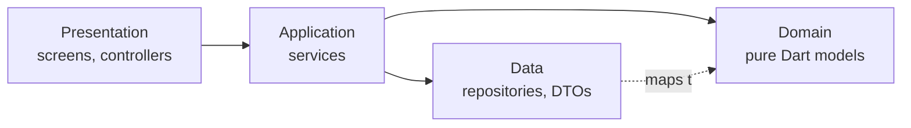

## Gate

On skill activation, emit verbatim once:

> tnds-flutter-app active. Pre-flight required.

Before writing code in any Trigger Map area, read the listed reference and emit `Reading: <ref-name>`.

After every code change to a `.dart` file:

1. Run `rps gen build` if any `@riverpod` / `@Riverpod` / `@JsonSerializable` annotation was touched.
2. Run `rps analyze`. Block on any error.
3. Emit the filled-in Pre-Flight checklist before yielding the turn.

## Critical Rules

1. **Layer chain is law**: `Presentation → Application → Domain ← Data`. The call chain is always Controller (presentation) → Service (application) → Repository (data). Presentation NEVER imports `data/` or reads a `*RepositoryProvider`. [architecture-layers.md](references/architecture-layers.md)

2. **Every repository call goes through a Service class** in `application/` — a plain class holding `Ref` with one `@riverpod` provider. `@riverpod Future<T> getXxx(Ref ref)` function providers that call repositories are FORBIDDEN; the legacy ones in this codebase are listed in [MIGRATION.md](MIGRATION.md) — never replicate them. [service-layer.md](references/service-layer.md)

3. **Repositories are concrete classes** extending `ViperaBaseRepository`, exposed via `@Riverpod(keepAlive: true)`; the provider override is the only test/fake seam. No abstract interfaces, no `Impl` suffix. [data-layer.md](references/data-layer.md)

4. **Riverpod codegen only.** `@Riverpod(keepAlive: true)` for Dio/repos/storage/router/module session controllers; `@riverpod` (auto-dispose) for screen controllers and services. Never manual `Provider(...)` variants; never hand-edit `*.g.dart`. [riverpod-state.md](references/riverpod-state.md)

5. **Async mutations use `AsyncValue.guard()`**; screens render via `AsyncValue.when` / `SystemAsyncValueWidget`. No try/catch that hides errors from `.when(error:)`; no `StatefulWidget` for server state. [riverpod-state.md](references/riverpod-state.md)

6. **All errors are `AppException`** via `AppException.parse(...)`; honor `ActionCodeType` (`EXIT_FLOW` exits the flow at controller/service level, never in widgets). `ErrorLogger` for errors; no `print()` in `lib/src/`. [error-handling.md](references/error-handling.md)

7. **json_serializable only — NO freezed.** DTOs have `fromJson`/`toJson` (+ `@JsonKey`, `explicitToJson: true` for nesting); repositories map DTO → domain noun and DTOs never leak past the data layer. [data-layer.md](references/data-layer.md)

8. **Navigation by enum + `TndsRouter` mixin**: `context.goNamed(XRouter.y.name)` — never raw path strings. Deeplink routes use `queryParameters` only. Services navigate via `ref.read(goRouterProvider)`. [navigation.md](references/navigation.md)

9. **New repository ⇒ ASK the user which Dio client** (`mymoMsDio` / `viperaDio` / `viperaAppSaltDio` / `cdnDio` / `viperaConfigDio`). The salt is a backend crypto contract that cannot be inferred — never copy a neighbor's choice. [dio-clients.md](references/dio-clients.md)

10. **Never hand-roll the module lifecycle.** Launchable modules use the three shared rails (`ModuleControllerMixin`, `loadWhenSessionReady`, `ModuleLauncherBase` + `ModuleScaffold`), are registered in `lib/src/router/module_registry.dart`, and the word `Module` marks module-control classes only. [module-launcher.md](references/module-launcher.md)

11. **Widget tests are Robot-only.** Every interaction/assertion goes through `Robot` (`test/src/robot.dart`) or a feature robot; a missing helper means extending the Robot, never calling `tester.*` / `find.*` in a test body. Fakes injected via `overrideRepos`. [testing.md](references/testing.md)

12. **No hardcoded UI strings**: `LocaleKeys.x.tr()` (regenerate with `rps gen lang`), or explicitly `.hardcoded` for temporary text. New keys must also reach the remote translation source — flag it. [localization.md](references/localization.md)

13. **Widget conventions**: extract sub-widgets as classes (no `_buildXxx()` methods); `if (cond) Widget()` over ternary-SizedBox; spacing/radius/shadows via `Sizes.kP*` / `kGap*` / `kRadius*` / `kShadow*`; colors/typography via `Theme.of(context).appColors` / `.appTexts` — no raw literals. Reuse `lib/src/common_widgets/` first. [widgets-theming.md](references/widgets-theming.md)

14. **No cross-feature imports** of another feature's `application/` or `presentation/`. Shared concerns live in `lib/src/shared/`; cross-module wiring happens only at `module_registry.dart`. No new packages without user approval. [architecture-layers.md](references/architecture-layers.md)

## Trigger Map

Before writing code in any row below, output `Reading: <ref-name>` and read the reference.

| Touching | Read |
|---|---|
| New feature, file placement, layer/import direction, cross-feature import | [architecture-layers.md](references/architecture-layers.md) |
| Service class, use-case logic, any `ref.read(xRepositoryProvider)` outside `data/`, controller needs data | [service-layer.md](references/service-layer.md) |
| `@riverpod`, controller, AsyncValue, keepAlive, ref.watch/read/listen/invalidate | [riverpod-state.md](references/riverpod-state.md) |
| Repository, DTO, `@JsonSerializable`, `postOp`, domain model, fake repository | [data-layer.md](references/data-layer.md) |
| New repository provider, Dio injection, encryption/salt, cert pinning | [dio-clients.md](references/dio-clients.md) |
| try/catch, AppException, actionCode, EXIT_FLOW, AsyncValue.guard, ErrorLogger | [error-handling.md](references/error-handling.md) |
| GoRoute, router enum, goNamed/pushNamed, deeplink, route params | [navigation.md](references/navigation.md) |
| LaunchableModule, Module{Launcher,Controller,Service}, ModuleScaffold, session/module token, module_registry | [module-launcher.md](references/module-launcher.md) |
| Any widget, screen layout, spacing, color, text style, theme | [widgets-theming.md](references/widgets-theming.md) |
| User-facing string, LocaleKeys, `.tr()`, translations | [localization.md](references/localization.md) |
| Any test file, Robot, fakes, mocks, coverage | [testing.md](references/testing.md) |
| New file/class name, rename, file suffix | [naming-conventions.md](references/naming-conventions.md) |
| build_runner, rps, flavor, entry point, analyze, hooks, running the app | [tooling-workflow.md](references/tooling-workflow.md) |

## Companion Workflow Skills

Step-by-step task templates bundled under [skills/](skills/) — each is a standalone skill that follows this package's standard (install into `.claude/skills/` or invoke by reading the file):

| Skill | Use when |
|---|---|
| [generate-api](skills/generate-api/SKILL.md) | Scaffolding a full API stack (domain → DTO → repo → fake → Service class → controller) from an operation name + JSON samples |
| [add-module](skills/add-module/SKILL.md) | Scaffolding a complete `LaunchableModule` (controller, launcher, service, screens, router, registry) |
| [add-locale-key](skills/add-locale-key/SKILL.md) | Adding translation keys to `th/` + `en/` JSON and regenerating `LocaleKeys` |
| [fix-analysis](skills/fix-analysis/SKILL.md) | Driving `flutter analyze` to zero (auto-fix → classify → fix in dependency order) |
| [commit-plan-from-diff](skills/commit-plan-from-diff/SKILL.md) | Splitting uncommitted changes into dependency-ordered commits |
| [review-uncommitted](skills/review-uncommitted/SKILL.md) | Pre-commit review of changed lines against rules R1–R11 |
| [codebase-alignment-review](skills/codebase-alignment-review/SKILL.md) | Reviewing files against nearby patterns + the 11 alignment checks |

## Adoption (installing into a project)

How content loads in Claude Code — and therefore why there are two install steps:

- **Skills** load only when invoked → step 1 makes them invocable.
- **`.claude/rules/` and `CLAUDE.md`** load automatically every session → step 2 puts the critical rules there so they are never missed.

### Step 1 — copy the package and symlink the skills

Copy this whole folder into the target repo (any path works; `docs/claude-skill/` is the convention), then from the repo root:

```sh
cd .claude/skills

# the standard itself
ln -s ../../docs/claude-skill/tnds-flutter-app tnds-flutter-app

# the 7 workflow skills
for s in add-locale-key add-module generate-api fix-analysis \
         commit-plan-from-diff codebase-alignment-review review-uncommitted; do
  ln -s "../../docs/claude-skill/tnds-flutter-app/skills/$s" "$s"
done
```

Relative symlinks survive cloning, so this is a one-time, per-repo setup.

### Step 2 — create slim pointer rules (auto-loaded guardrails)

For each topic, add a small file under `.claude/rules/` that contains ONLY a link into the package plus the few rules that must never be missed. Example (`.claude/rules/04-navigation.md`):

```markdown
# Navigation Rules

> Full rules: docs/claude-skill/tnds-flutter-app/references/navigation.md

Non-negotiables:
- Enum-based navigation only: `context.goNamed(XRouter.y.name)` — never raw path strings.
- Deeplink entry routes pass params via `queryParameters` only.
```

Rule of thumb: 3–5 bullets per file, never paste reference content in — the package must stay the only place the full rules live. This repo's `.claude/rules/` shows the complete set of 10. (A section in `CLAUDE.md` works too, if the project doesn't use `.claude/rules/`.)

### Adapting to a different app

The references describe the MyMo SME codebase (file paths, class names like `ViperaBaseRepository`, `TndsRouter`). When adopting elsewhere: sweep `references/` for facts that don't match the new app, and drop `MIGRATION.md` — it lists this repo's legacy debt, not yours.

## Architecture



```
lib/src/
├── features/<name>/
│   ├── application/      # services, module launchers/controllers
│   ├── data/             # repositories, dto/{request,response}/, fake/
│   ├── domain/           # pure Dart nouns
│   ├── presentation/     # screens, controllers, widgets
│   └── router/           # enum with TndsRouter + GoRoute list
├── shared/               # same 4-way split, used by 2+ features (module rails live here)
├── common_widgets/  router/  exceptions/  themes/  constants/  utils/  localization/
```

## Core Stack

| Package | Purpose | Constraint |
|---|---|---|
| Flutter 3.41.6 (FVM-pinned) | Framework | use `fvm flutter` |
| riverpod + riverpod_annotation | State (codegen) | annotations only |
| go_router | Navigation | enum + `TndsRouter` |
| json_serializable + build_runner | Serialization | **no freezed** |
| dio (5 configured clients) | HTTP | client choice = user-confirmed |
| easy_localization + generated LocaleKeys | i18n (remote-loaded) | th/en |
| mocktail (+ Robot pattern) | Testing | Robot-only widget tests |

## Pre-Flight

Fill after any `.dart` write; emit before yielding the turn.

- [ ] `rps gen build` run if annotations/DTOs touched; `rps analyze` clean
- [ ] No `*RepositoryProvider` read outside `data/` or a Service class
- [ ] No `@riverpod` function provider calling a repository (Rule 2)
- [ ] Controllers: `AsyncValue.loading()` + `AsyncValue.guard(...)`; no swallowed errors
- [ ] DTOs: `fromJson`/`toJson`; repository returns a domain noun; fake updated with the repo
- [ ] New repository: Dio client confirmed with the user
- [ ] Navigation via `XRouter.y.name`; deeplink params via queryParameters
- [ ] Strings via `LocaleKeys.x.tr()` or `.hardcoded`; sizes/colors via tokens, no literals
- [ ] Sub-widgets are classes; `if (cond) Widget()`; common_widgets reused
- [ ] Tests Robot-only; new helpers added to Robot; fakes via `overrideRepos`
- [ ] Module work on the three rails; `Module` naming correct; registered in `module_registry.dart`
- [ ] No cross-feature internals import; no new packages

## Recap

1. Controller → Service → Repository — all three hops, always; no function providers touching repos.
2. Codegen everything; guard mutations; render AsyncValue.
3. New repo ⇒ ask which Dio client (crypto contract).
4. Modules ride the shared rails; `Module` names = control classes only.
5. Widget tests speak Robot, nothing else.
